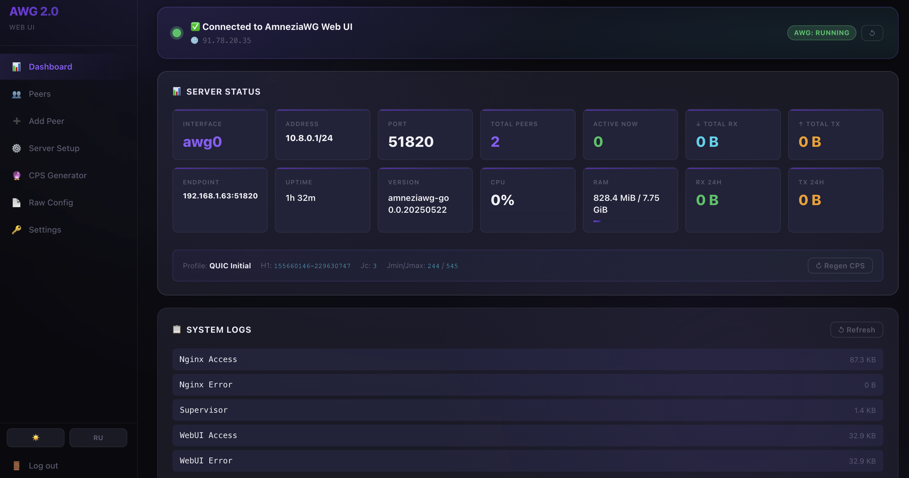
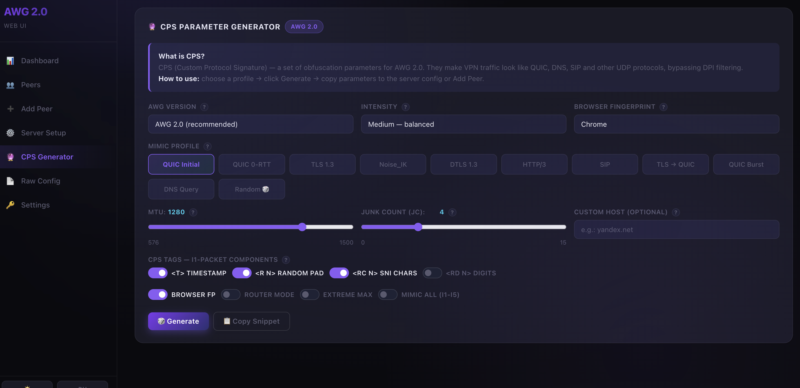
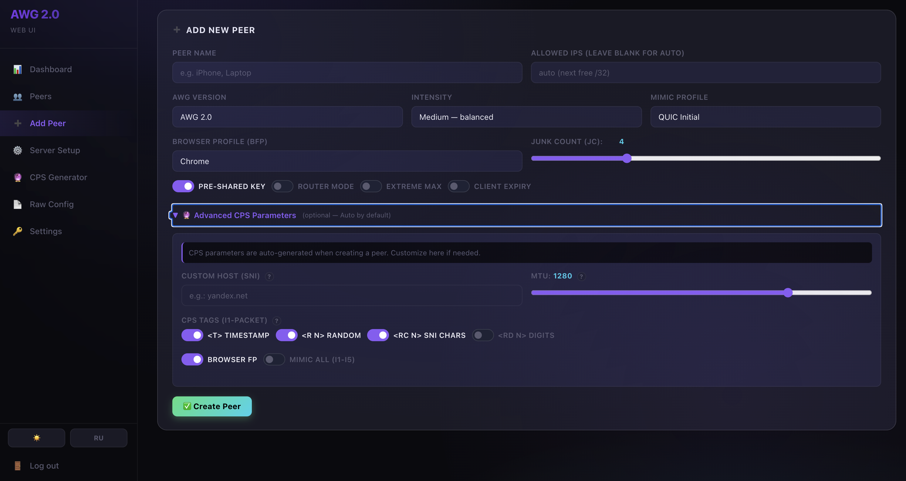

# AWG 2.0 Web UI

Web management panel for [AmneziaWG 2.0](https://github.com/amnezia-vpn/amneziawg-go) VPN server.
Built entirely from source — no pre-built binaries.

[](https://github.com/Pashgen/awg2-webui/actions/workflows/build.yml)
[](https://github.com/Pashgen/awg2-webui/releases)


## Screenshots

| Dashboard | CPS Generator | Add Peer |
|---|---|---|
|  |  |  |

## Features

- 🔒 **HTTPS** — self-signed or Let's Encrypt (via Web UI)
- 👥 **Peer management** — add, remove, suspend, QR code, one-click download
- 📊 **Dashboard** — AWG status, uptime, CPU/RAM, 24h traffic charts
- 🌍 **Geo + ping** — country flag and latency per peer
- 🔮 **CPS generator** — QUIC/TLS/DTLS/SIP profile obfuscation parameters
- 🔔 **Alerts** — AWG down, peer no handshake >2h
- 🌐 **i18n** — English / Russian
- 📦 **Prometheus** metrics endpoint

## Quick Start

```bash
docker run -d \
  --name awg2-webui \
  --cap-add NET_ADMIN \
  --cap-add SYS_MODULE \
  --sysctl net.ipv4.ip_forward=1 \
  -v awg_config:/etc/amnezia/amneziawg \
  -v /lib/modules:/lib/modules:ro \
  -p 443:443 -p 80:80 -p 51820:51820/udp \
  -e WEB_USER=admin \
  -e WEB_PASS=changeme \
  -e AWG_ENDPOINT=auto \
  ghcr.io/Pashgen/awg2-webui:latest
```

Open **https://localhost** in browser (accept self-signed cert warning).

## Docker Compose

```bash
curl -O https://raw.githubusercontent.com/Pashgen/awg2-webui/main/docker-compose.yml
# Edit WEB_PASS and AWG_ENDPOINT
docker compose up -d
```

## Environment Variables

| Variable | Default | Description |
|---|---|---|
| `WEB_USER` | `admin` | Web UI username |
| `WEB_PASS` | `admin` | Web UI password — **change this!** |
| `SECRET_KEY` | auto | Flask session secret key |
| `AWG_ENDPOINT` | `auto` | Server endpoint sent to clients (`IP:PORT`) |
| `AWG_PORT` | `51820` | AWG listen port |
| `AWG_INTERFACE` | `awg0` | AWG interface name |
| `AWG_SUBNET` | `10.8.0.0/24` | VPN subnet |
| `AWG_DNS` | `1.1.1.1,8.8.8.8` | DNS for clients |
| `SSL_DOMAIN` | — | Domain for Let's Encrypt (or configure via UI) |
| `SSL_EMAIL` | — | Email for Let's Encrypt |

## Platforms

| Platform | Use case |
|---|---|
| `linux/amd64` | MikroTik CHR, VPS, x86 servers |
| `linux/arm64` | Raspberry Pi 4, Oracle ARM, Apple M1 VMs |
| `linux/arm/v7` | Raspberry Pi 3, older ARM devices |

## MikroTik CHR

See **[docs/mikrotik-chr.md](docs/mikrotik-chr.md)** for full RouterOS Container deployment guide.

Key differences from standard deployment:
- Uses `iptables-legacy` (required by RouterOS kernel)
- nginx: `sendfile off; aio off;` (overlayfs compatibility)
- Load image via `docker save` + `scp` + `/container add`

## Build from Source

```bash
git clone https://github.com/Pashgen/awg2-webui
cd awg2-webui

# Local (native arch)
docker build -t awg2-webui:local .

# Multi-platform
docker buildx build --platform linux/amd64,linux/arm64,linux/arm/v7 \
  -t ghcr.io/Pashgen/awg2-webui:latest --push .
```

## Architecture

```
┌─────────────────────────────────────────┐
│  Docker Container                        │
│                                          │
│  nginx (443 HTTPS / 80 HTTP)            │
│    └→ Flask (5000) — Python Web UI      │
│                                          │
│  amneziawg-go (userspace AWG)           │
│    └→ awg0 interface (51820/udp)        │
│                                          │
│  supervisord — process manager          │
│  tini — PID 1 / signal handling        │
└─────────────────────────────────────────┘
```

Built in 3 stages:
1. **Stage 1** — `amneziawg-go` from source (Go)
2. **Stage 2** — `awg` + `awg-quick` tools from source (C)
3. **Stage 3** — Alpine runtime + Flask Web UI

## SSL Configuration

### Option A — Self-signed (default, works everywhere)
Configure via **Settings → SSL** in the Web UI.
Browser will show a certificate warning — accept it once.

### Option B — Let's Encrypt
```bash
# Port 80 must be publicly accessible
-e SSL_DOMAIN=vpn.example.com
-e SSL_EMAIL=admin@example.com
```
Or configure via **Settings → SSL → Let's Encrypt** in the Web UI.
Certificate renews automatically every Tuesday at 03:00.

## License

MIT

---

## 🇷🇺 Инструкция на русском

### Быстрый старт

```bash
docker run -d \
  --name awg2-webui \
  --cap-add NET_ADMIN \
  --cap-add SYS_MODULE \
  --sysctl net.ipv4.ip_forward=1 \
  -v awg_config:/etc/amnezia/amneziawg \
  -v /lib/modules:/lib/modules:ro \
  -p 443:443 -p 80:80 -p 51820:51820/udp \
  -e WEB_USER=admin \
  -e WEB_PASS=ВашПароль \
  -e AWG_ENDPOINT=auto \
  ghcr.io/Pashgen/awg2-webui:latest
```

Откройте **https://localhost** в браузере (примите предупреждение о self-signed сертификате).

### Docker Compose

```bash
curl -O https://raw.githubusercontent.com/Pashgen/awg2-webui/main/docker-compose.yml
# Отредактируйте WEB_PASS и AWG_ENDPOINT
docker compose up -d
```

### Переменные окружения

| Переменная | По умолчанию | Описание |
|---|---|---|
| `WEB_USER` | `admin` | Логин для входа в Web UI |
| `WEB_PASS` | `admin` | Пароль — **обязательно смените!** |
| `SECRET_KEY` | авто | Секретный ключ сессии Flask |
| `AWG_ENDPOINT` | `auto` | Адрес сервера для клиентов (`IP:PORT`) |
| `AWG_PORT` | `51820` | Порт AWG |
| `AWG_SUBNET` | `10.8.0.0/24` | Подсеть VPN |
| `AWG_DNS` | `1.1.1.1,8.8.8.8` | DNS для клиентов |
| `SSL_DOMAIN` | — | Домен для Let's Encrypt (или настройте через UI) |
| `SSL_EMAIL` | — | Email для Let's Encrypt |

### SSL сертификат

**Self-signed** (работает везде, браузер покажет предупреждение):
Настройте через **Settings → SSL → Self-signed** прямо в Web UI.

**Let's Encrypt** (нужен реальный домен и открытый порт 80):
```bash
-e SSL_DOMAIN=vpn.example.com
-e SSL_EMAIL=admin@example.com
```
Или через **Settings → SSL → Let's Encrypt** в Web UI.
Сертификат обновляется автоматически каждый вторник в 03:00.

### MikroTik CHR

Полная инструкция по развёртыванию на RouterOS Container: **[docs/mikrotik-chr.md](docs/mikrotik-chr.md)**

Ключевые отличия от стандартного деплоя:
- Образ использует `iptables-legacy` (требует ядро RouterOS)
- nginx: `sendfile off; aio off;` (совместимость с overlayfs)
- Образ загружается через `docker save` → `scp` → `/container add`

**Получить образ для CHR (amd64):**
```bash
docker pull ghcr.io/Pashgen/awg2-webui:latest
docker save ghcr.io/Pashgen/awg2-webui:latest -o awg2-webui.tar
scp awg2-webui.tar admin@<IP_CHR>:disk1/awg2-webui.tar
```

### Сборка из исходников

```bash
git clone https://github.com/Pashgen/awg2-webui
cd awg2-webui
docker build -t awg2-webui:local .
```
